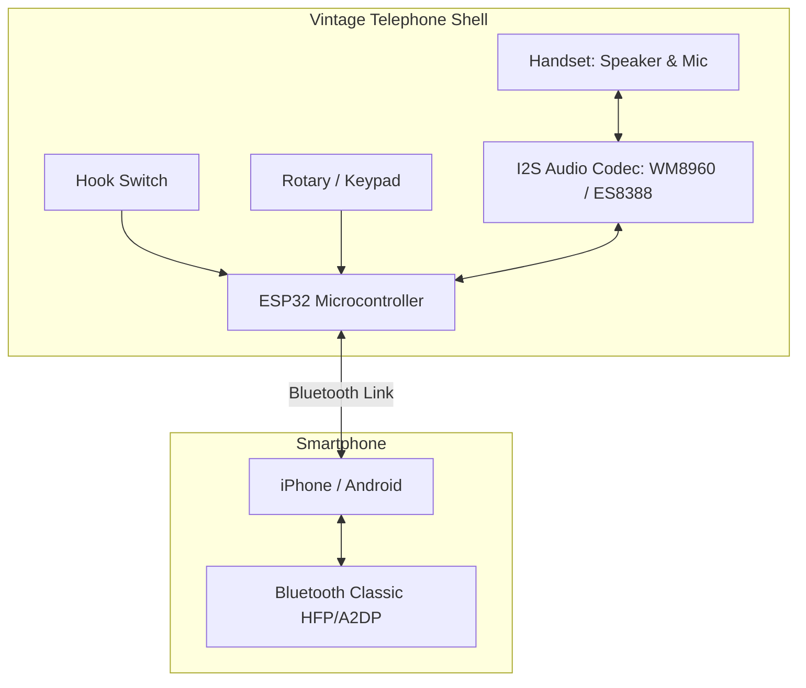
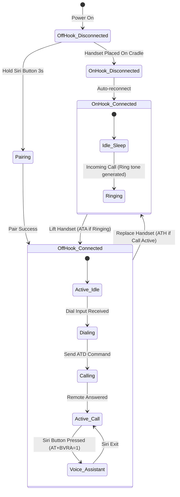

# Retro Bluetooth Landline Phone (Physical Phone Specification)

A system design document for converting a vintage landline telephone (rotary or keypad) into a Bluetooth Hands-Free Profile (HFP) device that pairs with modern smartphones (iOS/Android).

---

## 1. System Overview

This project aims to convert a vintage telephone (e.g., a Western Electric Model 500 or similar) into a fully functional Bluetooth handset. The hardware mimics a Bluetooth car kit or headset, routing the phone's audio through the landline receiver and converting mechanical inputs (hook switch, dial) into standard Bluetooth call controls.



---

## 2. Hardware Architecture & Bill of Materials (BOM)

### 2.1 Microcontroller Selection
* **Component:** ESP32 Development Board (specifically **ESP-WROOM-32**).
* **Rationale:** The original ESP32 supports **Bluetooth Classic (BR/EDR)**, which is required for the **Hands-Free Profile (HFP)**. 
  > [!WARNING]
  > Newer chips like ESP32-S2, S3, and C3 only support Bluetooth Low Energy (BLE) out-of-the-box and cannot establish standard Bluetooth audio/HFP connections to smartphones without external hardware.

### 2.2 Audio Subsystem
* **Component:** Audio Codec Board (e.g., **WM8960** or **ES8388**).
* **Rationale:** Landline handset speakers are low impedance (typically 150Ω) and vintage carbon or dynamic mics require custom biasing. An audio codec provides:
  * Integrated **DAC** (Digital-to-Analog) for the handset earpiece.
  * Integrated **ADC** (Analog-to-Digital) with microphone pre-amp & bias for the handset mic.
  * Standard **I2S interface** to transfer digital audio to/from the ESP32.

### 2.3 Interface Inputs
* **Hook Switch:** Double-Pole Double-Throw (DPDT) leaf switch built into the vintage phone cradle.
* **Rotary Dial:** Two switches:
  1. *Normally Closed (NC) Pulse Switch:* Generates a pulse train (breaks contact) proportional to the number dialed.
  2. *Normally Open (NO) Off-Hook Switch:* Closes when the dial is rotated away from rest, silencing the line and signaling dialing activity.
* **Keypad (Alternative):** Standard 3x4 matrix membrane keypad.

### 2.4 Power Management
* **Battery:** 18650 Li-Ion Battery (3.7V, 2500mAh+).
* **Charger:** TP4056 Charger Module with protection circuit.
* **Regulator:** ME6211 or AP2112 3.3V Low-Dropout (LDO) regulator (capable of handling 500mA peaks during Bluetooth transmission).

---

## 3. Wiring Diagram

```
                 +-----------------------------------------+
                 |                 ESP32                   |
                 |                                         |
                 |   GPIO 22 (I2C SCL) <-> Codec SCL       |
                 |   GPIO 21 (I2C SDA) <-> Codec SDA       |
                 |   GPIO 26 (I2S DAC) <-> Codec DACLRC    |
                 |   GPIO 25 (I2S ADC) <-> Codec ADCLRC    |
                 |   GPIO 27 (I2S CLK) <-> Codec BCLK      |
                 |   GPIO 33 (I2S MCLK)<-> Codec MCLK      |
                 |                                         |
                 |   GPIO 12 (Input/Pullup) <-------+      |
                 |                                  |      |
                 |   GPIO 14 (Input/Pullup) <--+    |      |
                 |                             |    |      |
                 +-----------------------------|----|------+
                                               |    |
                                               v    v
                                             [Hook Switch] -> GND (Closed = On-hook)
                                             [Dial Pulse]  -> GND (Pulses when dialing)
```

---

## 4. Software & Firmware Architecture

The firmware runs on **ESP-IDF** or **Arduino core for ESP32** utilizing the FreeRTOS scheduler. It consists of three concurrent tasks:

1. **Bluetooth Task:** Manages the HFP state machine, handles audio streaming over I2S, and sends/receives AT commands.
2. **Dial Decoding Task:** Decodes rotary pulse counts or scans the matrix keypad.
3. **System Control Task:** Monitors the hook switch, handles power states, and interfaces with status LEDs.

### 4.1 State Machine



---

## 5. Bluetooth Profile & AT Commands (RFCOMM)

The ESP32 communicates control data with the smartphone over a Virtual Serial Port (RFCOMM channel) using the **Bluetooth Hands-Free Profile (HFP v1.7)** spec.

### 5.1 Connection Handshake Sequence
Upon connection, the phone and ESP32 exchange capabilities:
1. ESP32 sends supported features: `+BRSF: <features>`
2. Phone responds with its features: `+BRSF: <phone_features>`
3. Phone requests indicator descriptions: `AT+CIND=?`
4. Phone requests indicator status: `AT+CIND`
5. ESP32 enables indicators: `AT+CMER=3,0,0,1`
6. Handshake complete; status is set to **Connected**.

### 5.2 Control Commands

| Event / Action | HFP Command / Response | Description |
|---|---|---|
| **Answer Call** | `ATA` | Sent by ESP32 when handset is lifted during incoming call. |
| **Hang Up** | `ATH` | Sent by ESP32 when handset is placed back on the cradle. |
| **Dial Number** | `ATD+1234567890;` | Sent by ESP32 when dial input is finished. |
| **Redial Last** | `AT+BLDN` | Can be mapped to dialing "0" or a fast hook-flash. |
| **Trigger Siri / Assistant** | `AT+BVRA=1` | Enables Voice Recognition on the phone. |
| **Incoming Call Alert** | `+CIEV: 1,1` (from Phone) | Triggered when call state changes to Ringing. ESP32 generates ring output. |

---

## 6. Edge Cases & Retro Integration Details

### 6.1 Rotary Pulse Decoding
* **The Math:** Rotary dials pulse at roughly **10 Hz** (100ms per pulse cycle) with a **60% break / 40% make** ratio. 
* **The Algorithm:** 
  1. Detect initial fall (interrupt-driven).
  2. Start a debounced pulse counter.
  3. If no new pulse is received for **300ms**, consider dialing of that digit complete.
  4. Collect digits in a buffer. If no digit is dialed for **2 seconds**, transmit the buffered number using `ATD`.

### 6.2 Microphone Biasing & Noise Cancelling
* Vintage carbon mics require about 8V–12V DC bias, which is noisy and difficult to extract from a 3.3V system.
* **Solution:** Replace the carbon capsule inside the vintage handset with a modern electret condenser microphone capsule. Connect this capsule directly to the MICIN pin of the WM8960 codec, utilizing the codec's integrated microphone bias regulator (MICBIAS).
